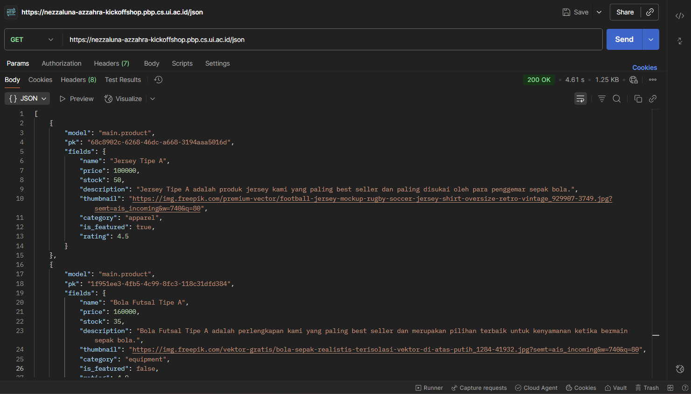
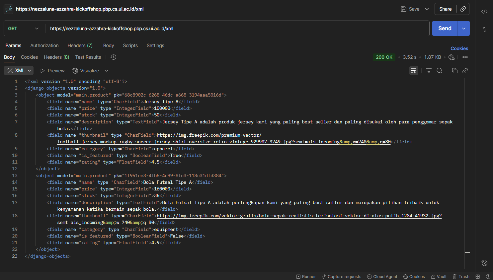
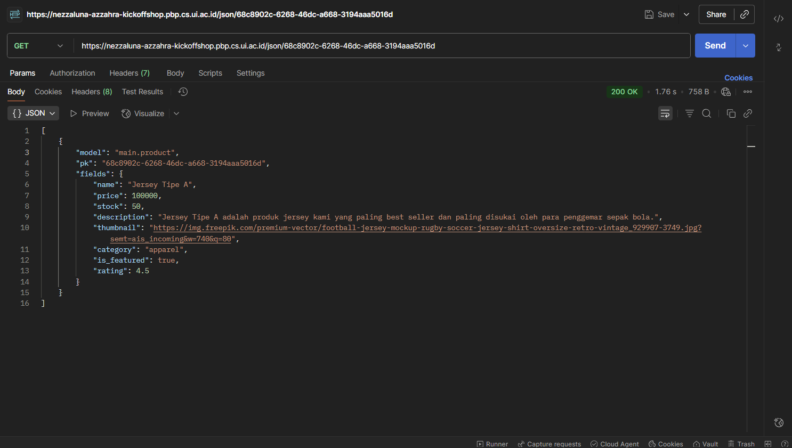
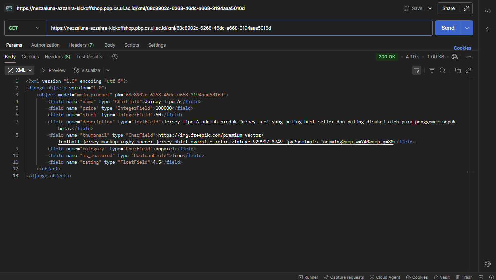

# KickOff Shop

KickOff Shop adalah project Django sederhana mengenai toko yang menjual perlengkapan sepak bola. Tugas ini dikerjakan oleh Nezzaluna Azzahra dengan NPM 2406495741 dari kelas PBP-D.

## Tugas 2

**Implementasi checklist step by step.**

1. Membuat project Django dengan langkah-langkah seperti mengaktifkan virtual environemnt, menginstall dependencies, membuat projrct Django dengan command "django-admin startproject kickoff-shop .", membuat konfigurasi environment variables melalui kredensial database yang telah dibagikan, mengatur konfigurasi di settings.py(menambah library, mengubah allowed hosts, menambah konfigurasi production, mengubah konfigurasi database), melakukan migrasi dan run server, sehingga web dapat diakses melalui local host(localhost:8000). Tambahan langkah yaitu membuat file .gitignore untuk mengabaikan file-file yang tidak perlu dilacak oleh Git.
2. Membuat aplikasi main dengan command "python manage.py startapp main".Kemudian diikuti langkah-langkah seperti mendaftarkan aplikasi main ke installed apps di kickoff_shop/settings.py.
3. Melakukan routing pada project agar dapat menjalankan aplikasi main dengan langkah- langkah seperti membuat file urls.py pada folder main, mendaftarkan routing main ke project pada url patterns di kickoff_shop/urls.py.
4. Membuat model pada aplikasi main dengan nama Product dan memiliki atribut beserta tipe data dan parameternya sesuai ketentuan pada tugas. Kemudian melakukan migrasi model dengan command "makemigrations" dan "migrate".
5. Membuat folder templates dalam folder main kemudian membuat file main.html yang berisi kode HTML yang menampilkan nama aplikasi dan parameter nama, NPM, dan kelas. Kemudian membuat fungsi show_main pada main/views.py untuk dikembalikan ke dalam template HTML, sehingga data pada fungsi show_main dapat ditampilkan.
6. Membuat routing pada urls.py aplikasi main untuk memetakan fungsi yang telah dibuat pada views.py dengan import fungsi show_main dari main/views.py dan membuat url patterns untuk memetakan fungsi show_main.
7. Setelah menyelesaikan tiap langkah, selalu melakukan add, commit, dan push ke GitHub.
8. Melakukan deployment ke PWS terhadap aplikasi yang sudah dibuat dengan langkah-langkah seperti membuat project baru di PWS, mengubah environs dengan kredensial database, menambahkan URL web di allowed hosts, melakukan add, commit, dan push ke GitHub, kemudian menjalankan command git di Project Command kemudian mengisi username dan password.
9. Akhirnya web dapat diakses melalui URL yang telah dibuat di PWS.

**Jawaban Pertanyaan**

- Buatlah bagan yang berisi request client ke web aplikasi berbasis Django beserta responnya dan jelaskan pada bagan tersebut kaitan antara urls.py, views.py, models.py, dan berkas html.  
    
  Pertama user akan mengirim HTTP request ke server dan akan diproses oleh urls.py yang kemudian diteruskan ke view.py yang sesuai dengan request tersebut. Kemudian views.py akan memproses request tersebut dengan membaca/menulis data dari/ke models.py dan views.py akan mengirim data tersebut ke template (berkas HTML) untuk dirender. Setelah itu, template akan menghasilkan halaman yang sesuai dengan data yang diterima dari views.py. Akhirnya, halaman tersebut akan dikirim kembali ke user sebagai HTTP response.
- Jelaskan peran settings.py dalam proyek Django!  
  Secara umum settings.py berfungsi untuk mengatur konfigurasi pada project Django yang sedang dikerjakan. Beberapa konfigurasi yang diatur pada settings.py antara lain adalah konfigurasi database, aplikasi yang digunakan/diinstall untuk project, host yang diizinkan, templates dan static, middleware, informasi keamanan, dan konfigurasi lainnya.
- Bagaimana cara kerja migrasi database di Django?  
  Migrasi model adalah cara framework Django untuk melacak perubahan pada model basis data pada project dan command migrasi ini dilakukan untuk mengubah struktur tabel basis data sesuai dengan perubahan model yang didefinikan dalam kode terbaru. Cara kerja migrasi database di Django adalah dengan menjalankan command "make migrations" untuk membuat berkas migrasi yang berisi perubahan model yang belum diaplikasikan ke dalam basis data. Kemudian, menggunakan command "migrate" untuk menerapkan migrasi ke dalam basis data lokal, command tersebut mengaplikasikan perubahan model yang tercantum dalam berkas migrasi ke basis data dengan menjalankan command sebelumnya. Setiap kali melakukan perubahan pada model, migrasi harus selalu dilakukan untuk merefleksikan perubahan tersebut.
- Menurut Anda, dari semua framework yang ada, mengapa framework Django dijadikan permulaan pembelajaran pengembangan perangkat lunak?  
  Menurut saya, framework Django dijadikan permulaan pembelajaran pengembangan perangkat lunak karena Django menyediakan banyak fitur bawaan dan library yang memudahkan pengembangan aplikasi web, menerapkan konsep MVT dimana Django memisahkan antara data, logika, dan tampilan sehingga memiliki struktur project yang jelas, memiliki keamanan bawaan yang baik, mudah integrasi dengan database, serta memiliki dapat digunakan untuk mengembangkan dari project skala kecil hingga besar.
- Apakah ada feedback untuk asisten dosen tutorial 1 yang telah kamu kerjakan sebelumnya?  
  Asisten dosen sudah stand-by ketika tutorial sehingga dapat membantu jika ada pertanyaan atau kendala.

## Tugas 3

**Implementasi checklist step by step.**

1. Menambahkan 4 fungsi views untuk melihat objek yang sudah ditambahkan dalam format XML, JSON, XML by ID, dan JSON by ID dengan import HttpResponse dan serializers dari Django, membuat fungsi show_xml dan show_json dimana pada masing-masing fungsi membuat product_list yang berisi semua objek atau data dari Product, kemudian membuat serialize untuk mentranslate objek pada product_list menjadi format XML/JSON, setelah itu fungsi mereturn HttpResponse untuk mengembalikan data dalam bentuk XML/JSON. Sedangkan untuk melihat objek by ID dengan membuat fungsi show_xml_by_id dan show_json_by_id dimana pada masing-masing memiliki exception handling apabila data dengan id tersebut tidak ada akan memberi HttpResponse dengan status 404, membuat product_item yang berisi objek atau data dari Product yang difilter sesuai id yang diinginkan, kemudian sisanya sama dengan kedua fungsi sebelumnya.
2. Membuat routing URL untuk masing-masing views yang telah ditambahkan dengan mengimport fungsi yang telah dibuat di main/views.py, kemudian membuat url patterns baru di main/urls.py dan menambahkan path untuk mengakses fungsi yang telah diimport.
3. Membuat halaman yang menampilkan data objek model yang memiliki tombol "Add" yang akan redirect ke halaman form, serta tombol "Detail" pada setiap data objek model yang akan menampilkan halaman detail objek dengan mengubah main/templates/main.html, dengan menambahkan button add product yang link ke create_product untuk merender halaman create_product.html, kemudian membuat conditional apabila tidak ada data di product_list, apabila data ada maka akan merender kode dengan semua data yang ada di product_list, kemudian menambahkan button product detail yang link ke show_product dengan parameter product_id untuk merender dan menuju halaman product_detail.
4. Membuat halaman form untuk menambahkan objek model pada app sebelumnya dengan membuat file forms.py di direktori main, kemudian mengimport ModelForm dari Django dan data model Product dari main/models.py, setelah itu membuat class ProductForm dengan model Product dan fields yang berisi data yang ingin dimunculkan di form. Setelah itu membuat fungsi create_product di main/views.py. Kemudian membuat file create_product.html untuk membuat halaman form dengan extends base.html, membuat form dengan method POST, menambahkan csfr_token untuk keamanan, menampilkan form dengan {{ form.as_table }}, dan menambahkan button add product dengan tipe submit dan yang terakhir membuat routing di main/urls.py untuk mengarahkan ke view create_product.
5. Membuat halaman yang menampilkan detail dari setiap data objek model dengan membuat file product_detail.html untuk membuat halaman detail produk dengan extends base.html. Setelah itu membuat fungsi show_product di main/views.py yang berfungsi untuk mengambil data produk sesuai id yang dikirim. Setelah itu membuat kode untuk menampilkan data dengan memanggil fungsi tersebut di main/views.py. Kemudian membuat routing URL untuk mengakses fungsi show_product dengan mengimport fungsi show_product dari main.
6. Mengakses keempat URL menggunakan Postman, membuat screenshot dari hasil akses URL pada Postman, dan menambahkannya ke dalam README.md.
     
     
     
   

**Jawaban Pertanyaan**

- Jelaskan mengapa kita memerlukan data delivery dalam pengimplementasian sebuah platform?  
  Kita memerlukan data delivery dalam pengimplementasian sebuah platform karena dengan data delivery, data dapat dikirimkan dari server ke user dengan format yang terstrruktur dan mudah dipahami. Data delivery juga memungkinkan integrasi antara berbagai sistem atau app yang berbeda sehingga saling terhubung dan bekerja sama, sehingga data dapat digunakan secara efisien dan efektif. Dalam tugas ini, data delivery digunakan untuk mengirimkan data produk dalam format XML dan JSON yang dapat diakses oleh user.
- Menurutmu, mana yang lebih baik antara XML dan JSON? Mengapa JSON lebih populer dibandingkan XML?  
  Menurut saya, JSON lebih baik dibandingkan XML karena JSON lebih ringkas dan mudah dibaca, dimana JSON memakai key-value sederhana, sedangkan XML memakai banyak tag yang membuatnya lebih panjang. Selain itu, JSON lebih mudah diparse dan digenerate oleh banyak bahasa pemrograman, sehingga lebih kompatibel. JSON juga lebih ringan dan efisien dimana ukuran file JSON biasanya lebih kecil dibandingkan XML, sehingga lebih cepat dalam pengiriman data. JSON juga lebih mudah diintegrasikan dengan JavaScript, karena JSON adalah bagian natural dari JavaScript.
- Jelaskan fungsi dari method is_valid() pada form Django dan mengapa kita membutuhkan method tersebut?  
  Fungsi dari method is_valid() pada form Django adalah untuk memvalidasi data yang dikirimkan oleh user melalui form. Method ini memeriksa apakah data yang dimasukkan sesuai dengan aturan validasi yang telah ditentukan pada form, seperti kesesuaian tipe data, panjang karakter, format email, dan sebagainya. Apabila data valid, method ini akan mengembalikan nilai True, sehingga data dapat diproses lebih lanjut, seperti pada tugas data yang valid akan disimpan ke dalam database. Sebaliknya, apabila data tidak valid, method ini akan mengembalikan nilai False, sehingga data tidak akan diproses dan user akan diberitahu mengenai kesalahan yang terjadi. Kita membutuhkan method tersebut untuk memastikan bahwa data yang diterima dari user sudah benar dan sesuai dengan aturan validasi yang ditetapkan, sehingga dapat mencegah kesalahan atau inkonsistensi data dalam aplikasi.
- Mengapa kita membutuhkan csrf_token saat membuat form di Django? Apa yang dapat terjadi jika kita tidak menambahkan csrf_token pada form Django? Bagaimana hal tersebut dapat dimanfaatkan oleh penyerang?  
  Kita membutuhkan csrf_token saat membuat form di Django untuk melindungi aplikasi dari salah satu serangan siber, yaitu Cross-Site Request Forgery (CSRF). csrf_token adalah token unik yang dihasilkan oleh server dan disisipkan ke dalam form sebagai hidden field. Token ini akan dicek ulang oleh server ketika form dikirimkan untuk memastikan request tersebut benar-benar berasal dari user atau aplikasi kita, bukan dari pihak luar yang ingin melakukan serangan. Apabila kita tidak menambahkan csrf_token pada form Django, maka server tidak bisa memverifikasi keaslian atau asal request tersebut, sehingga aplikasi menjadi rentan terhadap serangan CSRF. Penyerang dapat memanfaatkan celah ini dengan membuat halaman atau form palsu yang mengirimkan request ke server kita tanpa sepengetahuan user dan request tersebut dianggap valid oleh server, sehingga penyerang dapat melakukan tindakan yang tidak diinginkan, seperti mengotak-atik data user, melakukan transaksi palsu, atau hak akses lain milik user dapat disalahgunakan. Oleh karena itu, menambahkan csrf_token pada form adalah penerapan keamanan yang penting untuk melindungi aplikasi dari serangan CSRF.
- Apakah ada feedback untuk asdos di tutorial 2 yang sudah kalian kerjakan?  
  Asisten dosen sudah stand-by ketika tutorial sehingga dapat membantu jika ada pertanyaan atau kendala.
