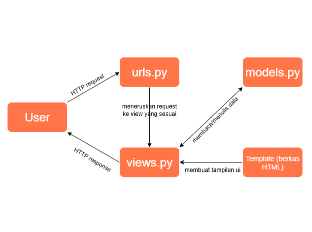

# KickOff Shop

KickOff Shop adalah project Django sederhana mengenai toko yang menjual perlengkapan sepak bola. Tugas ini dikerjakan oleh Nezzaluna Azzahra dengan NPM 2406495741 dari kelas PBP-D.

## Tugas 2

Langkah-langkah pengerjaan project:

1. Membuat project Django dengan langkah-langkah seperti mengaktifkan virtual environemnt, menginstall dependencies, membuat projrct Django dengan command "django-admin startproject kickoff-shop .", membuat konfigurasi environment variables melalui kredensial database yang telah dibagikan, mengatur konfigurasi di settings.py(menambah library, mengubah allowed hosts, menambah konfigurasi production, mengubah konfigurasi database), melakukan migrasi dan run server, sehingga web dapat diakses melalui local host(localhost:8000). Tambahan langkah yaitu membuat file .gitignore untuk mengabaikan file-file yang tidak perlu dilacak oleh Git.
2. Membuat aplikasi main dengan command "python manage.py startapp main".Kemudian diikuti langkah-langkah seperti mendaftarkan aplikasi main ke installed apps di kickoff_shop/settings.py.
3. Melakukan routing pada project agar dapat menjalankan aplikasi main dengan langkah- langkah seperti membuat file urls.py pada folder main, mendaftarkan routing main ke project pada url patterns di kickoff_shop/urls.py.
4. Membuat model pada aplikasi main dengan nama Product dan memiliki atribut beserta tipe data dan parameternya sesuai ketentuan pada tugas. Kemudian melakukan migrasi model dengan command "makemigrations" dan "migrate".
5. Membuat folder templates dalam folder main kemudian membuat file main.html yang berisi kode HTML yang menampilkan nama aplikasi dan parameter nama, NPM, dan kelas. Kemudian membuat fungsi show_main pada main/views.py untuk dikembalikan ke dalam template HTML, sehingga data pada fungsi show_main dapat ditampilkan.
6. Membuat routing pada urls.py aplikasi main untuk memetakan fungsi yang telah dibuat pada views.py dengan import fungsi show_main dari main/views.py dan membuat url patterns untuk memetakan fungsi show_main.
7. Setelah menyelesaikan tiap langkah, selalu melakukan add, commit, dan push ke GitHub.
8. Melakukan deployment ke PWS terhadap aplikasi yang sudah dibuat dengan langkah-langkah seperti membuat project baru di PWS, mengubah environs dengan kredensial database, menambahkan URL web di allowed hosts, melakukan add, commit, dan push ke GitHub, kemudian menjalankan command git di Project Command kemudian mengisi username dan password.
9. Akhirnya web dapat diakses melalui URL yang telah dibuat di PWS.

**Jawaban Pertanyaan**

- Buatlah bagan yang berisi request client ke web aplikasi berbasis Django beserta responnya dan jelaskan pada bagan tersebut kaitan antara urls.py, views.py, models.py, dan berkas html.
  
- Jelaskan peran settings.py dalam proyek Django!
  Secara umum settings.py berfungsi untuk mengatur konfigurasi pada project Django yang sedang dikerjakan. Beberapa konfigurasi yang diatur pada settings.py antara lain adalah konfigurasi database, aplikasi yang digunakan/diinstall untuk project, host yang diizinkan, templates dan static, middleware, informasi keamanan, dan konfigurasi lainnya.
- Bagaimana cara kerja migrasi database di Django?
  Migrasi model adalah cara framework Django untuk melacak perubahan pada model basis data pada project dan command migrasi ini dilakukan untuk mengubah struktur tabel basis data sesuai dengan perubahan model yang didefinikan dalam kode terbaru. Cara kerja migrasi database di Django adalah dengan menjalankan command "make migrations" untuk membuat berkas migrasi yang berisi perubahan model yang belum diaplikasikan ke dalam basis data. Kemudian, menggunakan command "migrate" untuk menerapkan migrasi ke dalam basis data lokal, command tersebut mengaplikasikan perubahan model yang tercantum dalam berkas migrasi ke basis data dengan menjalankan command sebelumnya. Setiap kali melakukan perubahan pada model, migrasi harus selalu dilakukan untuk merefleksikan perubahan tersebut.
- Menurut Anda, dari semua framework yang ada, mengapa framework Django dijadikan permulaan pembelajaran pengembangan perangkat lunak?
  Menurut saya, framework Django dijadikan permulaan pembelajaran pengembangan perangkat lunak karena Django menyediakan banyak fitur bawaan dan library yang memudahkan pengembangan aplikasi web, menerapkan konsep MVT dimana Django memisahkan antara data, logika, dan tampilan sehingga memiliki struktur project yang jelas, memiliki keamanan bawaan yang baik, mudah integrasi dengan database, serta memiliki dapat digunakan untuk mengembangkan dari project skala kecil hingga besar.
- Apakah ada feedback untuk asisten dosen tutorial 1 yang telah kamu kerjakan sebelumnya?
  Asisten dosen sudah stand-by ketika tutorial sehingga dapat membantu jika ada pertanyaan atau kendala.
